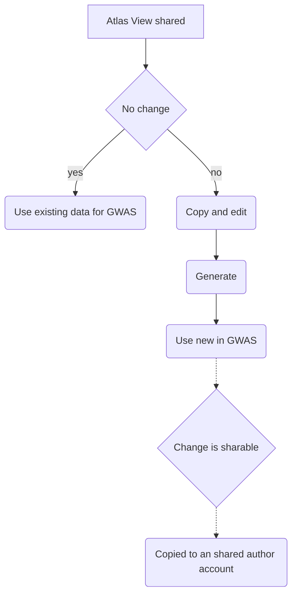

### Requirements for a shared artifact feature in Atlas that functions with MVP GWAS

- A small group of users will serve as authors of cohort and concept set artifacts that are sharable to all MVP users.
    - The users would be a part of an authoring team which gives them the ability to share 'globally' (across all users with a reader role)
        -  the same users could switch to other teams that do not authoring role to have the usual user experience
    -  Authors will share artifacts as follows:
        - in Atlas, they will use the share feature (currently a lock icon) and select an option (e.g., checkbox) to share to all
    -  Users who do not have the author role cannot share concept set and cohort definition artifacts

- Shared *concept set* definitions are read-only and become visible to other teams within both the concept set endpoint and for import into their cohort definitions.

- Shared *cohort definitions* are read-only and cannot be 'generated' by other users (in other words, the 'generate' should be hidden until they copy to their own account/team account)   

- Authors are able to generate cohorts for shared cohort definitions
    - The 'generated' cohort (set of person ids) that was generated by authors will already be available to all users in the GWAS app

- If users *do* need to make a change, users must copy the shared artifacts prior to making a change. Then, they must generate the artifacts for them to become available in the GWAS app.

- When users copy an artifact and change it as described above, the authoring team will see that this has happened in their regular reports. The authoring team may review and copy the artifact (as with any artifact) and decide to make the copy sharable to all MVP users. 

- We need to find a way to make sure that a user with 'read restricted Atlas Users' role do not ever get assigned a role with '*' permission (e.g., conceptset:*:get or cohortdefinition:*:get) b.c. this would perpetuate so that they would have access to artifacts across the system.
    - This might be implemented as a DB constraint (if possible as 'TRIGGER' restraint?) in postgres, which is the only DBMS used for security
        - or, could be implemented as a trigger in the Java model code
    - Note that the Atlas admin manage permissions interface should ensure that 'read restricted Atlas Users' do not get assigned roles with '*' permissions. 

### Permission states of artifacts based on the requirements

| actor  | artifact type | artifact start status | change/decision | artifact end status | roles and WebAPI actions | 
| ------------- | ------------- | ------------- | ------------- | ------------- | ------------- |
| author  | concept set  | uncreated | created | viewable to all users in Atlas | MVP users have 'shared reader' role for specific artifact |
| user  | concept set   | viewable to all users in Atlas | copy | viewable to user's group and authors| MVP team role is assigned to the specific artifact, 'shared reader' role removed |
| author  | cohort def   | uncreated | created | viewable to all users in Atlas, can be generated by authors | MVP users have 'shared reader' role for specific artifact  |
| author  | cohort def   | viewable to all users in Atlas, can be generated by authors | generate | viewable to all users in Atlas and GWAS | MVP users have 'shared reader' role for specific artifact  |
| user  | cohort def   | viewable to users in the team in Atlas and GWAS | user copy | copy is viewable to user's group and authors  (Atlas only) | MVP team role is assigned to the specific artifact, 'shared reader' role removed  |
| user  | cohort def   | viewable to user's group only and authors (Atlas) | user generate | copy is viewable to user's group only and authors (Atlas and GWAS) | MVP team role retained for generated cohort, no 'shared reader' role |
| author  | cohort def | copy is viewable to user's group only and authors (Atlas and GWAS) | authors decide to share to all MVP users, artifact copied into an author's account  | copy of copy is viewable to all users in Atlas | MVP users have 'shared reader' role for specific artifact |
