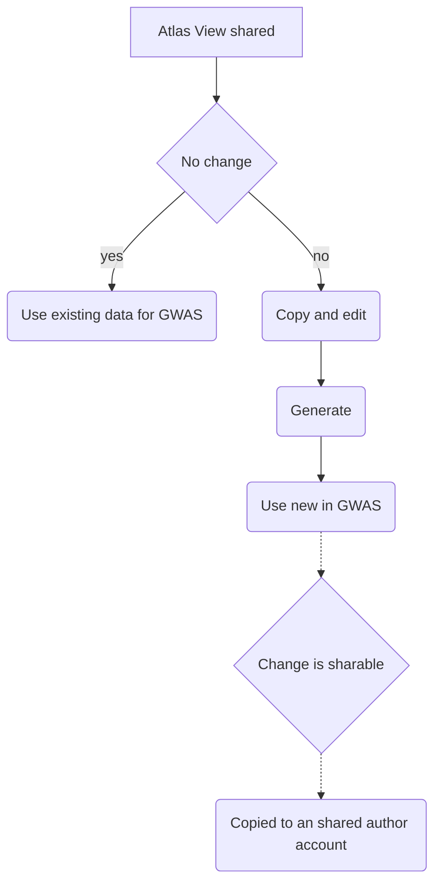

### Requirements for a shared artifact feature in Atlas that functions with MVP GWAS

- A small group of users will serve as authors of cohort and concept set artifacts that are sharable to all MVP users. The users on the authoring team can share 'globally' (across all users with a reader role). They do this in Atlas by accessing a share feature visible when editing an artifact (currently a lock icon) and select an option (e.g., checkbox) to share to all
    - The users who are authors should be able to log in to the MVP portal and choose to act either as an author or as a regular user
        - Authoring Yes: user logs into MVP, selects authoring team, system confirms access to that team, a permission is set that triggers Atlas can to show the feature that allows a user to share artifacts
          - authors also get a permission that allows them to see other teams' artifacts 
        - No Authoring: user logs into MVP, selects non-authoring team, system confirms access to that team, the system does *not* set the permission that triggers Atlas to show the feature to share artifacts,  this effectively removing sharing             
    -  Users who do not have the author role cannot share concept set and cohort definition artifacts
        - Operationally, they never see the share feature (see above)

- Differences between shared concept set and cohort definition artifacts:
    - Shared *concept set* definitions are read-only and become visible to other teams within both the concept set endpoint and for import into their cohort definitions.
    - Shared *cohort definitions* are read-only and cannot be 'generated' by other users (in other words, the 'generate' should be hidden until they copy to their own account/team account)   
    - Authors are able to generate cohorts for shared cohort definitions
        - The 'generated' cohort (set of person ids) that was generated by authors will already be available to all users in the GWAS app
    - If a user *does* need to make a change to either concept sets or cohort definitions, the user must copy the shared artifacts prior to making a change. Then, they must generate the artifacts for them to become available in the GWAS app under the new name they gave to it when copying.

- When users copy an artifact and change it as described above, the authoring team will see that this has happened in their regular reports. The authoring team may review and copy the artifact (as with any artifact) and decide to make the copy sharable to all MVP users.
    - This can happen simply by the authors copying the user's artifact, renaming it, and then sharing it.

- The above requirements imply the following dynamic management of roles and permissions by the WebAPI

### Dynamic role and permission management based on the requirements

| actor (login team)  | roles | permissions | 
| ------------- | ------------- | ------------- | 
| author  | authoring team role  | read all artifacts from all users, read/write owned artifacts, share owned artifacts |
| non-author  | regular team role  | read/write owned artifacts, read artifacts shared globally |

- When an author user changes from an authoring team to a non-authoring team, the system will ensure that the authoring role, which includes the permission that triggers Atlas to enable the 'share' feature and a permission that allows them to see other teams' artifacts, is removed.
    - 'read restricted Atlas Users' role do not ever get assigned a role with '*' permission (e.g., conceptset:*:get or cohortdefinition:*:get) b.c. this would perpetuate so that they would have access to artifacts across the system.
    - This might be implemented as a DB constraint (if possible as 'TRIGGER' restraint?) in postgres, which is the only DBMS used for security
        - or, could be implemented as a trigger in the Java model code
    - Note that the Atlas admin manage permissions interface should ensure that 'read restricted Atlas Users' do not get assigned roles with '*' permissions. 

| artifact  | state | permissions | 
| ------------- | ------------- | ------------- | 
| concept set | shared | all users with the regular team role have GET permissions to the concept set |
| concept set | not shared | the creator and the creator's team have read/write permissions to the concept set |
| cohort definition | shared | all users with the regular team role have GET permissions to the cohort definition, no ability to generate the cohort |
| cohort definition | not shared | the creator and the creator's team read/write permissions to the cohort definition and can generate it |

### Permission states of artifacts based on the requirements

| actor  | artifact type | artifact start status | change/decision | artifact end status | roles and WebAPI actions | 
| ------------- | ------------- | ------------- | ------------- | ------------- | ------------- |
| author  | concept set  | uncreated | created | viewable to all users in Atlas | MVP users have 'shared reader' role for specific artifact |
| user  | concept set   | viewable to all users in Atlas | copy | viewable to user's group and authors| MVP team role is assigned to the specific artifact, 'shared reader' role removed |
| author  | cohort def   | uncreated | created | viewable to all users in Atlas, can be generated by authors | MVP users have 'shared reader' role for specific artifact  |
| author  | cohort def   | viewable to all users in Atlas, can be generated by authors | generate | viewable to all users in Atlas and GWAS | MVP users have 'shared reader' role for specific artifact  |
| user  | cohort def   | viewable to users in the team in Atlas and GWAS | user copy | copy is viewable to user's group and authors  (Atlas only) | MVP team role is assigned to the specific artifact, 'shared reader' role removed  |
| user  | cohort def   | viewable to user's group only and authors (Atlas) | user generate | copy is viewable to user's group only and authors (Atlas and GWAS) | MVP team role retained for generated cohort, no 'shared reader' role |
| author  | cohort def | copy is viewable to user's group only and authors (Atlas and GWAS) | authors decide to share to all MVP users, artifact copied into an author's account  | copy of copy is viewable to all users in Atlas | MVP users have 'shared reader' role for specific artifact |
