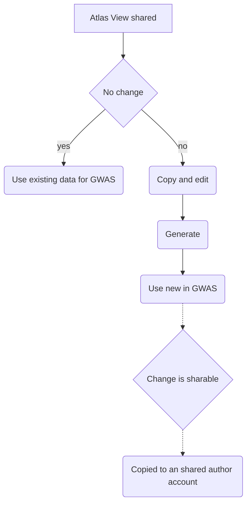

### Requirements for a shared artifact feature in Atlas that functions with MVP GWAS

- A small group of users will serve as authors of cohort and concept set artifacts that are sharable to all MVP users.

- Shared cohort artifacts should not be generated by users unless they make a change.

- If users do not need to make a change to a shared cohort artifact, the generated data will already be available to them in the GWAS app.

- If users do need to make a change, users must copy the shared artifacts prior to making a change. Then, they must generate the artifacts for them to become available in the GWAS app.

- When users make a change to an artifact, generate it, and use it in a GWAS run, the authoring team will see that this has happened in their regular reports. The authoring team may review the artifact and decide to make it sharable to all MVP users. 

